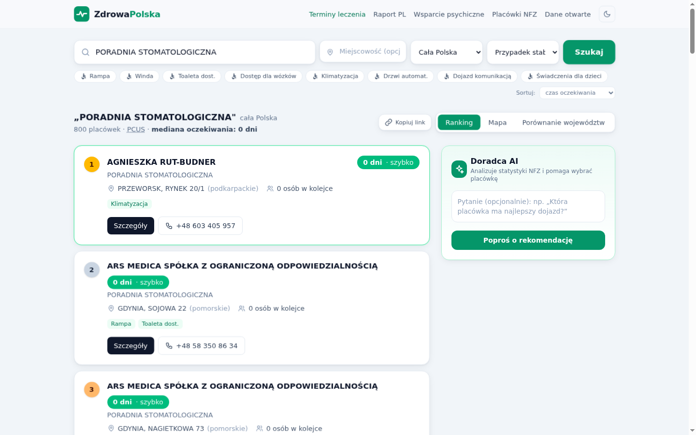
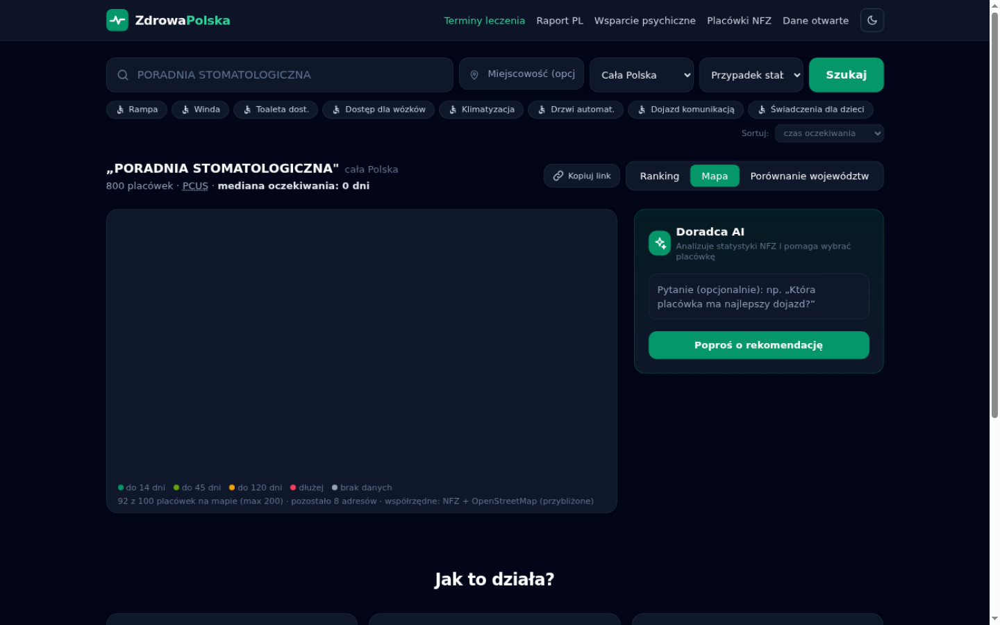
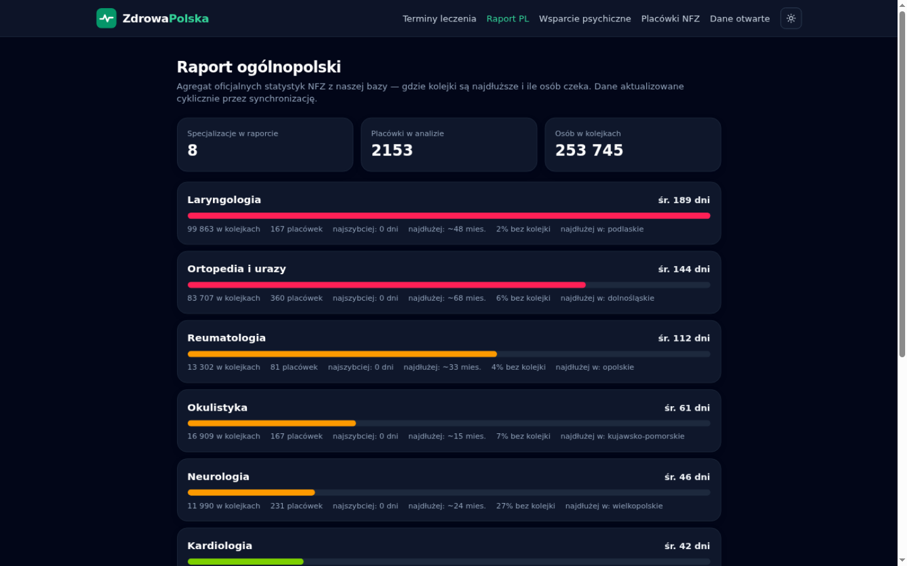

# 🏥 ZdrowaPolska

[](https://github.com/rafalohaki/zdrowapolska/actions/workflows/ci.yml)
[License: MIT](LICENSE)

**Gdzie do specjalisty najszybciej?** — porównywarka oficjalnych czasów oczekiwania NFZ ze wszystkich 16 oddziałów wojewódzkich, z filtrem dostępności architektonicznej i doradcą AI.

> Kategorie HackYeah: **Sport & Healthcare** · **Artificial Intelligence**

## 🔗 Live demo

**https://zdrowapolska.autarch.workers.dev** — backend: `yeapi.wpme.pl` (tunel Cloudflare).

Nagrania demo: [demo.webm](docs/demo/demo.webm) · [demo-full.webm](docs/demo/demo-full.webm) · [demo-final.webm](docs/demo/demo-final.webm)

## 🖼️ Zrzuty ekranu

| Ranking terminów (ciemny) | Mapa placówek | Raport ogólnopolski |
|---|---|---|
|  |  |  |

## ❗ Problem

Polacy czekają do specjalistów miesiącami — ale **czas oczekiwania zależy od miejsca nawet o rzędy wielkości**. NFZ publikuje te dane w niewygodnym do porównania formularzu, placówka po placówce. Nikt nie pokaże pacjentowi jednego prostego widoku: *„kardiolog: tutaj 0 dni, tutaj 8 miesięcy"*.

## 💡 Rozwiązanie

- **Ranking ogólnopolski** — jedno wyszukiwanie odpytuje wszystkie 16 oddziałów NFZ i sortuje placówki po najkrótszym czasie oczekiwania (prognoza PCUS + średnia liczba dni z oficjalnych statystyk).
- **Filtr dostępności** ♿ — rampa, winda, toaleta dostosowana, dostęp dla wózków, klimatyzacja, drzwi automatyczne, dojazd komunikacją miejską, świadczenia dla dzieci (dane z API NFZ — nikt tego nie eksponuje).
- **Porównanie województw** — wykres „gdzie w Polsce kolejka najkrótsza", klikalny (filtruje ranking).
- **Placówki NFZ** (zakładka) — apteki z umową NFZ, SOR-y, izby przyjęć i nocna pomoc świąteczna, per województwo, z wyszukiwaniem po nazwie (dane z serwisu „Gdzie się leczyć").
- **Doradca AI** — analizuje statystyki TOP placówek i odpowiada na pytania pacjenta (Groq / OpenRouter; **działa też bez kluczy** — wbudowany doradca heurystyczny).
- **Szczegóły placówki** — adres, telefon (klikalny), liczba oczekujących, miesiąc aktualizacji danych NFZ.
- **Dzielenie się wynikami** — stan wyszukiwania w URL (`?b=ODDZIAŁ KARDIOLOGICZNY&a=ramp`), linki działają po odświeżeniu.

## 🧱 Architektura

```
┌─────────────────────────┐         ┌────────────────────────────────────┐
│  Frontend (SPA)         │  HTTPS  │  Backend (Bun + Hono + Effect v4)   │
│  React 19 + Vite 8      │───────▶ │  yeapi.wpme.pl (tunel CF)          │
│  Tailwind CSS 4         │  JSON   │                                    │
│  Cloudflare Workers     │         │  ┌────────────┐  ┌──────────────┐  │
│  (wrangler deploy)      │         │  │ SQLite     │  │ Redis        │  │
└─────────────────────────┘         │  │ słownik +  │  │ hot cache    │  │
                                    │  │ snapshoty  │  │ (TTL)        │  │
                                    │  └────────────┘  └──────────────┘  │
                                    │  ┌────────────────────────────┐    │
                                    │  │ Meilisearch                │    │
                                    │  │ literówki + synonimy PL    │    │
                                    │  │ („dentysta" → stomatologia)│    │
                                    │  └────────────────────────────┘    │
                                    │  sync: kulturalny scraper NFZ      │
                                    └──────────────┬─────────────────────┘
                                                   │ 1 żądanie naraz, ~60 ms
                                                   ▼
                                    ┌──────────────────────────────┐
                                    │  API NFZ „Terminy Leczenia"  │
                                    │  apinfz.nfz.gov.pl (429!)    │
                                    └──────────────────────────────┘
```

**Ścieżka zapytania o porównanie 16 województw:**
1. świeży snapshot w SQLite (< 24 h, 16/16 województw)? → odpowiedź **~20 ms** z własnej bazy
2. nie ma / stary → żywe pobranie z NFZ (~15–60 s przy zimnym cache) + **zapis snapshotu** na przyszłość
3. synchronizacja w tle (harmonogram co 12 h) odświeża słownik + kolejki popularnych świadczeń

Dlaczego proxy: API NFZ **nie wysyła nagłówków CORS** i **rate-limituje po IP (HTTP 429)** — backend serializuje zapytania (1 równoległe, odstęp 60 ms, backoff). Świadomie **nie używamy rotacji IP/Tor** do obchodzenia limitów — zamiast tego dane są pobierane uprzednio do własnej bazy, co daje natychmiastowe odpowiedzi bez jakiegokolwiek spamowania API. Pełna wiedza o API: [docs/](docs/README.md) (zweryfikowana na żywo, ze zapisanymi specyfikacjami OpenAPI).

### Endpointy backendu

| Endpoint | Opis |
|---|---|
| `GET /api/search?q=` | wyszukiwarka świadczeń (Meilisearch: literówki + synonimy PL; fallback: SQLite → NFZ) |
| `GET /api/benefits?q=` · `GET /api/localities?q=` | autouzupełnianie świadczeń i miejscowości |
| `GET /api/compare?benefit=&case=` | porównanie 16 województw (najpierw SQLite, potem NFZ; zapisuje snapshoty) |
| `GET /api/queues-province?benefit=&province=` | kolejki jednego województwa (progresywne ładowanie na froncie) |
| `GET /api/facilities?locality=&benefit=` | placówki z NFZ GSL „Gdzie się leczyć" (telefony, adresy, nocna pomoc) |
| `GET /api/air?locality=` · `GET /api/air-stations?locality=` | jakość powietrza: stacja GIOŚ (po nazwie lub najbliższa wg współrzędnych) + czujniki obywatelskie Sensor.Community + Airly (opcjonalnie, `AIRLY_API_KEY`) |
| `POST /api/geocode` | geokodowanie adresów przez Nominatim (cache + fair-use 1 req/s) |
| `GET /api/insights` | raport ogólnopolski — agregaty z bazy snapshotów |
| `POST /api/ai` | doradca AI (`groq/compound`; fallback heurystyczny bez kluczy) |
| `GET /api/sync/status` · `POST /api/sync/trigger?scope=benefits\|queues\|all` | stan i sterowanie scraperem (trigger wymaga `SYNC_TOKEN`, jeśli ustawiony) |
| `POST /api/search/reindex` | przebudowa indeksu Meilisearch z lokalnej bazy (wymaga `SYNC_TOKEN`, jeśli ustawiony) |
| `GET /api/health` | health + statystyki bazy/cache |

Endpointy zapalające upstream (NFZ/GIOŚ/Nominatim/LLM) mają rate-limit per IP — `compare` 12/min, `queues-province` 90/min, `facilities` 30/min, `geocode` i `ai` 10/min, `sync/trigger` 5/min (odpowiedź 429 + `Retry-After`).

## 🚀 Szybki start

```bash
bun install
cp .env.example .env          # opcjonalnie: klucz GROQ_API_KEY / OPENROUTER_API_KEY
bun run dev                   # backend :2363 + frontend :5174 (Vite dev)
# → http://localhost:5174
```

Testy i jakość:

```bash
bun test                      # testy jednostkowe (parser PCUS, ranking, URL state)
bun run typecheck             # TypeScript strict (tsc, bez emitu)
bun run build                 # produkcyjny build frontendu do dist/
bunx playwright install       # raz — przeglądarki do E2E
bunx playwright test          # testy E2E (uwaga: uderzają w produkcyjne API yeapi.wpme.pl)
```

### Backend w Dockerze (produkcja na 192.168.1.11:2363 → yeapi.wpme.pl)

```bash
cp .env.example .env          # PORT=2363; ewentualnie klucze AI
docker compose up -d --build
curl http://localhost:2363/api/health
```

### Frontend na Cloudflare Workers

```bash
bun run deploy                # vite build + wrangler deploy (assets-only SPA)
# → https://zdrowapolska.<twoj-subdomena>.workers.dev
# własna domena: Cloudflare Dashboard → Workers → zdrowapolska → Domains
```

Adres backendu w produkcji ustawia się zmienną przy buildzie:

```bash
VITE_API_BASE=https://yeapi.wpme.pl bun run build && bunx wrangler deploy
```

## ⚙️ Zmienne środowiskowe (backend)

| Zmienna | Domyślnie | Opis |
|---|---|---|
| `PORT` | `2363` | port HTTP backendu |
| `NFZ_BASE` | adres produkcyjny API NFZ | można wskazać mock |
| `NFZ_MAX_CONCURRENT` | `1` | równoległe zapytania do NFZ (429!) |
| `NFZ_MIN_INTERVAL_MS` | `60` | odstęp między zapytaniami |
| `NFZ_COOLDOWN_MS` | `15000` | globalna pauza po HTTP 429 |
| `REDIS_URL` | — | `redis://redis:6379` (bez tego fallback: pamięć procesu) |
| `MEILI_URL` | — | `http://meilisearch:7700` (bez tego fallback: SQLite → NFZ) |
| `MEILI_MASTER_KEY` | — | klucz Meilisearch (ten sam w compose) |
| `DB_PATH` | `./data/...` | plik SQLite (volume `./data`) |
| `SNAPSHOT_TTL_H` | `24` | po tylu godzinach snapshot odświeżany przy zapytaniu |
| `SYNC_INTERVAL_H` | `12` | cykl synchronizacji w tle |
| `SYNC_MAX_QUEUES_PER_RUN` | `40` | limit świadczeń na cykl kolejek |
| `AI_PROVIDER` | `groq` | `groq` lub `openrouter` |
| `AI_MODEL` | `groq/compound` | np. `llama-3.3-70b-versatile` |
| `GROQ_API_KEY` / `OPENROUTER_API_KEY` | — | bez kluczy działa tryb lokalny |
| `CORS_ORIGIN` | `*` | lista dozwolonych originów (przecinki) |

## 📁 Struktura

```
server/          backend Bun+Hono (nfz.ts = klient NFZ z limiterem, ai.ts = doradca)
src/             frontend React 19 (lib/wait.ts = parser PCUS, komponenty UI)
test/            testy jednostkowe (bun:test)
docs/            baza wiedzy o polskich API publicznych (zweryfikowana!) + specyfikacje OpenAPI
Dockerfile       obraz backendu (oven/bun)
docker-compose.yml  serwis backend na :2363
wrangler.jsonc   konfiguracja Cloudflare Workers (assets-only SPA)
```

## ⚠️ Uczciwość wobec danych

NFZ publikuje **statystyki kolejek** (liczba oczekujących, średni czas, prognoza PCUS), a **nie wolne terminy wizyt** — aktualizacje są miesięczne. Aplikacja uczciwie to komunikuje (badge, sekcja „Jak to działa", stopka z zastrzeżeniami) i zachęca do potwierdzenia telefonicznego. W nagłych przypadkach: 112 / 999.

---

*Projekt hackathonowy. Dane: Narodowy Fundusz Zdrowia — API „Terminy Leczenia" v1.4.*
